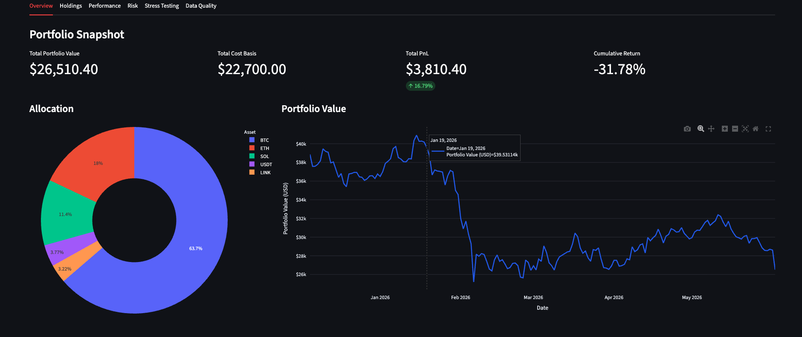
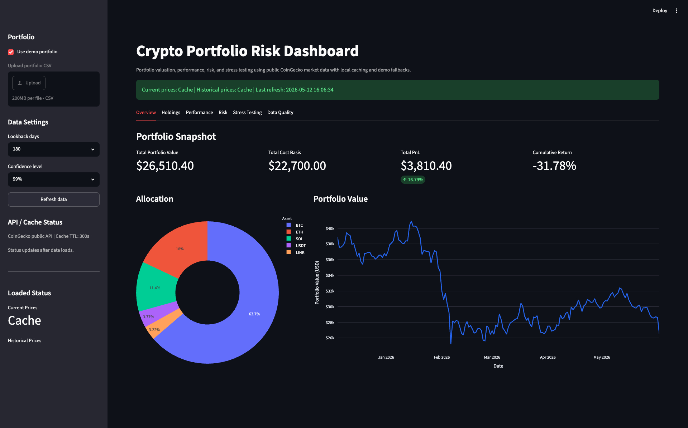
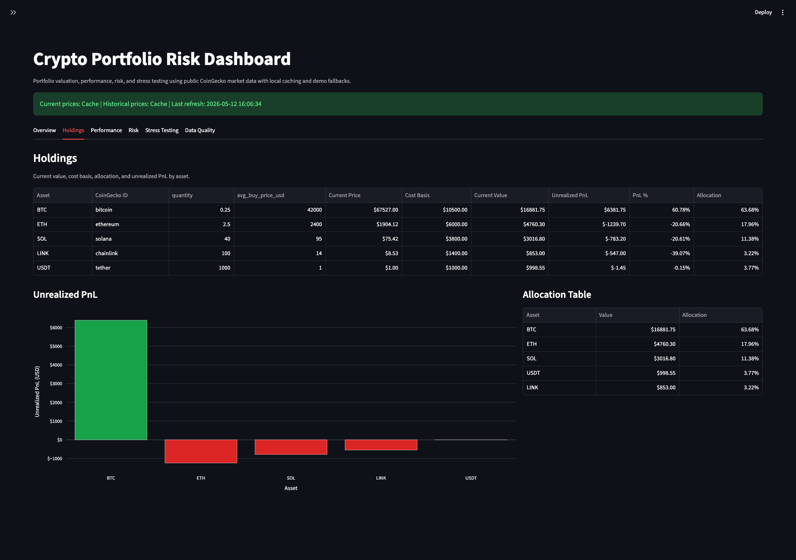
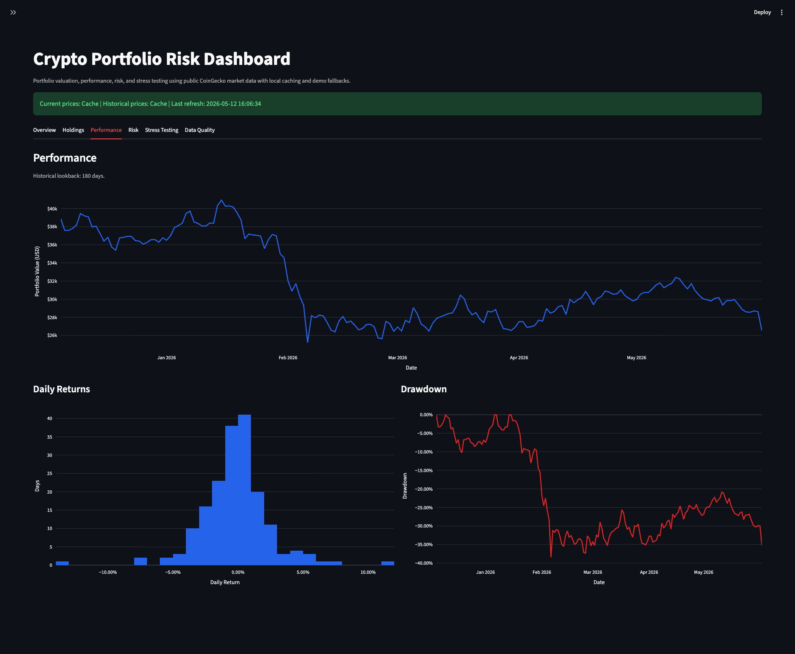
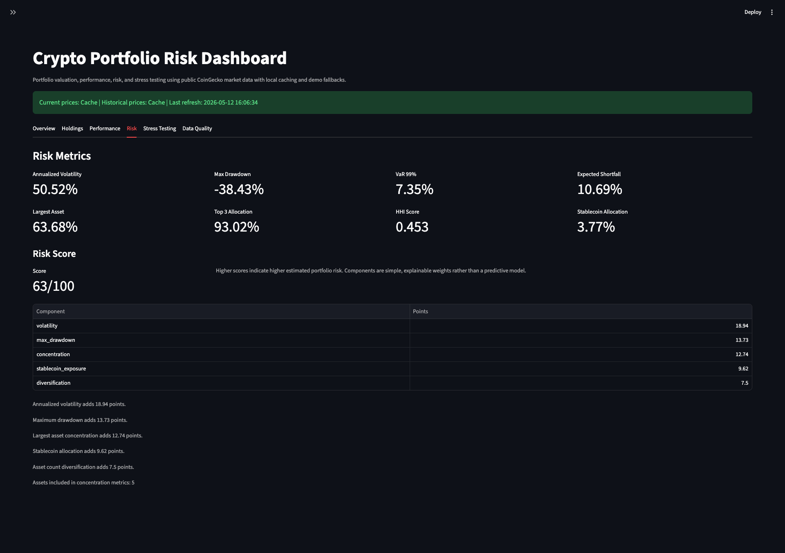
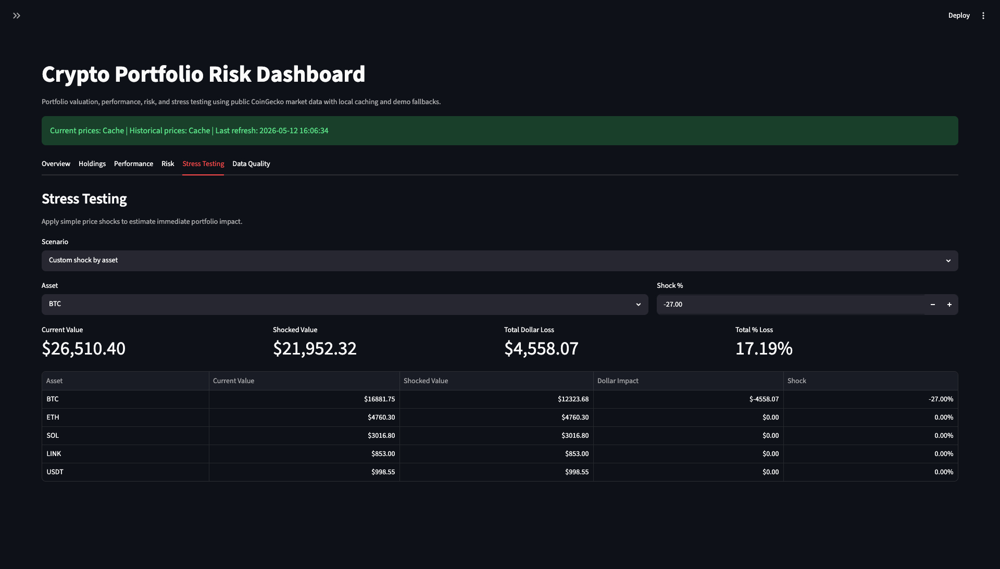
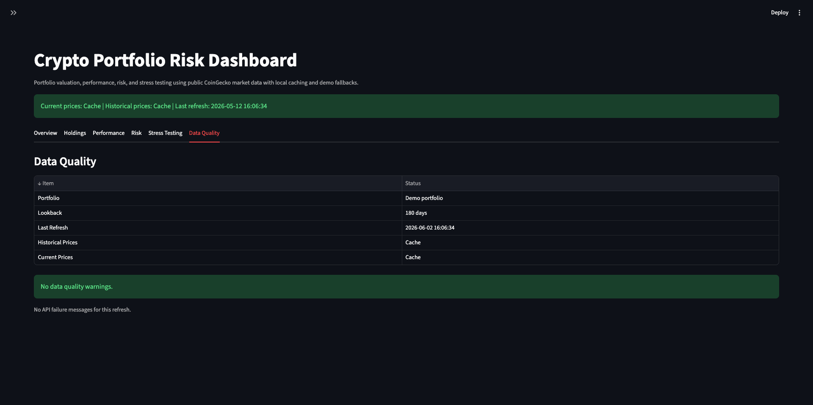
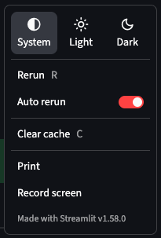

# Crypto Portfolio Risk Dashboard
 
A production-style Python and Streamlit dashboard for crypto portfolio valuation, performance analytics, risk metrics, and stress testing using free/public CoinGecko market data.

This project demonstrates practical Python backend/data engineering skills: API integration, local caching, validation, risk analytics, clean module separation, deterministic testing, Docker support, and a usable dashboard experience.

## Release Status

Final portfolio release.

Current capabilities:

- Streamlit dashboard with six production-style views
- CoinGecko public API integration with retries, timeout handling, local caching, and fallback data
- Portfolio upload and demo portfolio support
- Valuation, historical performance, risk analytics, and stress testing
- Data quality/status reporting
- Pytest and Ruff verification
- Docker and Docker Compose support

## Business Problem

Crypto portfolios can become difficult to evaluate because prices move continuously, assets are volatile, and concentration risk can build quickly. A user may know what assets they hold, but still lack a clear view of portfolio value, unrealized PnL, allocation, drawdowns, downside risk, and stress-test impact.

This dashboard turns a simple holdings CSV into an interactive portfolio risk view that helps answer:

- What is the portfolio worth today?
- Which assets drive allocation and PnL?
- How has the portfolio value changed historically?
- What are the volatility, drawdown, VaR, and expected shortfall?
- How concentrated is the portfolio?
- What happens under common stress scenarios?
- Is data coming from API, cache, or fallback demo values?

## Features

- Load a demo portfolio or upload a custom CSV
- Validate portfolio rows with Pydantic
- Fetch current prices from CoinGecko's public API
- Fetch historical market chart data by asset
- Cache API responses locally in `.cache/`
- Retry temporary API failures with timeout and backoff settings
- Fall back gracefully to demo data when API calls fail
- Calculate valuation, cost basis, current value, allocation, and unrealized PnL
- Build historical portfolio value from asset-level price histories
- Calculate daily returns and cumulative return
- Calculate annualized volatility, max drawdown, historical VaR, and expected shortfall
- Calculate concentration metrics: largest allocation, top 3 allocation, and HHI
- Generate a simple explainable 0-100 risk score
- Run preset and custom stress scenarios
- Show data source, refresh timestamp, missing data warnings, and API messages
- Test portfolio, risk, stress, storage, validation, and API-client logic

## Screenshots

- Overview

 
- Portfolio settings


- Holdings

 
- Performance


- Risk


- Stress testing


- Data quality


- App settings



## Tech Stack

- Python 3.11+
- Streamlit
- Pandas
- NumPy
- Plotly
- Requests
- Pydantic
- python-dotenv
- Pytest
- Ruff
- Docker / Docker Compose
- CoinGecko free/public API
- Local JSON file cache

## Architecture

The application keeps dashboard presentation separate from data and business logic.

```text
app.py
  Streamlit UI, tab layout, user controls, and display orchestration

src/models.py
  Pydantic portfolio models and validation rules

src/portfolio.py
  CSV loading, holding validation, valuation, historical value construction

src/coingecko_client.py
  CoinGecko requests, retries, timeouts, API parsing, cache-aware fetches

src/storage.py
  Local JSON cache helpers

src/risk.py
  Returns, volatility, drawdown, VaR, expected shortfall, concentration, risk score

src/stress.py
  Preset and custom stress-test scenario logic

src/charts.py
  Plotly chart builders

src/utils.py
  Formatting helpers

tests/
  Deterministic unit tests for core logic
```

This structure keeps `app.py` focused on Streamlit UI while reusable functions live under `src/`.

## Project Structure

```text
crypto-portfolio-risk-dashboard/
  app.py
  README.md
  requirements.txt
  .env.example
  .gitignore
  Dockerfile
  docker-compose.yml
  data/
    sample_portfolio.csv
  src/
    __init__.py
    charts.py
    coingecko_client.py
    config.py
    models.py
    portfolio.py
    risk.py
    storage.py
    stress.py
    utils.py
  tests/
    test_coingecko_client.py
    test_portfolio.py
    test_risk.py
    test_storage.py
    test_stress.py
    test_validation.py
```

## Quickstart

```bash
git clone 
cd crypto-portfolio-risk-dashboard
python3 -m venv .venv
source .venv/bin/activate
pip install -r requirements.txt
streamlit run app.py
```

Open the Streamlit URL shown in the terminal, usually:

```text
http://localhost:8501
```

## Configuration

Create a local `.env` file from the example:

```bash
cp .env.example .env
```

Available settings:

| Variable | Default | Description |
| --- | --- | --- |
| `DEFAULT_CURRENCY` | `usd` | Currency used for CoinGecko prices |
| `DEFAULT_LOOKBACK_DAYS` | `90` | Default historical lookback |
| `COINGECKO_BASE_URL` | `https://api.coingecko.com/api/v3` | CoinGecko API base URL |
| `CACHE_TTL_SECONDS` | `300` | Local cache time-to-live |
| `COINGECKO_TIMEOUT_SECONDS` | `10` | Request timeout |
| `COINGECKO_MAX_ATTEMPTS` | `3` | Retry attempts for temporary failures |
| `COINGECKO_BACKOFF_SECONDS` | `0.75` | Backoff multiplier between retries |

No API key is required.

## Run Locally

```bash
source .venv/bin/activate
streamlit run app.py
```

## Run Tests

```bash
source .venv/bin/activate
pytest
```

Expected final-release result:

```text
34 passed
```

Run lint checks:

```bash
ruff check .
```

## Run With Docker

Build and run with Docker:

```bash
docker build -t crypto-portfolio-risk-dashboard .
docker run -p 8501:8501 crypto-portfolio-risk-dashboard
```

Or use Docker Compose:

```bash
docker compose up --build
```

Then open:

```text
http://localhost:8501
```

The Compose setup mounts `.cache/` so API responses can persist between container runs.

## Sample Portfolio CSV Format

The dashboard expects this CSV schema:

```csv
asset_symbol,coingecko_id,quantity,avg_buy_price_usd
BTC,bitcoin,0.25,42000
ETH,ethereum,2.5,2400
SOL,solana,40,95
LINK,chainlink,100,14
USDT,tether,1000,1
```

Column requirements:

- `asset_symbol`: required; normalized to uppercase
- `coingecko_id`: required; normalized to lowercase
- `quantity`: required; must be `>= 0`
- `avg_buy_price_usd`: required; must be `>= 0`

## Dashboard Views

### Overview

- Total portfolio value
- Total cost basis
- Total PnL
- PnL percentage
- Allocation chart
- Historical portfolio value chart

### Holdings

- Clean valuation table
- Unrealized PnL by asset
- Allocation table

### Performance

- Historical portfolio value
- Daily returns histogram
- Drawdown chart

### Risk

- Annualized volatility
- Max drawdown
- VaR at selected confidence level
- Expected shortfall at selected confidence level
- Concentration metrics
- Explainable risk score components

### Stress Testing

- Preset scenarios
- Custom shock by asset
- Portfolio-level impact summary
- Asset-level impact table

### Data Quality

- API/cache/fallback source status
- Last refresh timestamp
- Missing historical data warnings
- API failure messages

## Risk Metrics Explained

- **Daily returns**: percentage change in portfolio value from one period to the next.
- **Cumulative return**: total return from the first historical portfolio value to the latest value.
- **Annualized volatility**: daily return volatility scaled to a 365-day year.
- **Max drawdown**: largest observed peak-to-trough decline in historical portfolio value.
- **Historical VaR**: estimated downside loss threshold from historical daily returns. Displayed as a positive loss magnitude.
- **Expected shortfall**: average loss beyond the VaR threshold. Displayed as a positive loss magnitude.
- **Largest asset allocation**: percentage of the portfolio in the largest position.
- **Top 3 allocation**: combined allocation of the three largest positions.
- **HHI score**: concentration score based on squared allocations.
- **Risk score**: simple explainable 0-100 score based on volatility, drawdown, concentration, stablecoin allocation, and number of assets.

## Stress Testing Explained

Preset stress scenarios:

- BTC drops 10%
- ETH drops 15%
- Broad market drops 20%
- Altcoins drop 30%
- Stablecoins depeg 5%
- Custom shock by asset

Scenario rules:

- Broad market shocks apply to all non-stablecoin assets.
- Altcoin shocks apply to non-BTC, non-ETH, non-stablecoin assets.
- Stablecoin depeg shocks apply to USDT, USDC, DAI, BUSD, and TUSD.
- Custom shocks apply to the selected asset.

Outputs:

- current portfolio value
- shocked portfolio value
- total dollar loss
- total percentage loss
- asset-level shocked values and impacts

## API, Cache, and Data Limitations

- Uses CoinGecko's free/public API.
- Public API rate limits may apply.
- The app uses local JSON caching to reduce repeated API calls.
- Manual refresh bypasses cache and can hit API rate limits if used repeatedly.
- Historical data availability can vary by asset.
- API failures are handled with retries and fallback demo data.
- Prices are market-data estimates and may not match exchange execution prices.
- The app does not connect to exchanges, wallets, private keys, or trading accounts (but can be implemented).
- No live trading or order execution is implemented.

## Note

This is a production-style portfolio project, not a regulated production risk platform. For real production use, additional work would be required:

- authenticated users and access control
- durable database storage
- observability and alerting
- stronger API quota management
- CI/CD pipeline
- deployment hardening
- formal model validation
- richer data reconciliation

## Disclaimer

This project uses free/public crypto market data for demonstration purposes. It is not financial advice, does not execute trades, and should not be used for live trading or institutional risk decisions.
